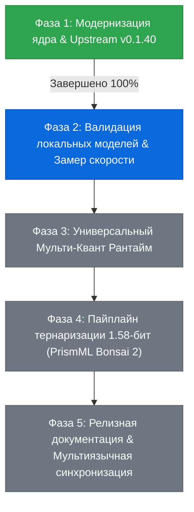

# Комплексный план модернизации Strata: Архитектура, Универсальная совместимость и Тернарный инференс (TQ1_0)

## 1. Концепция и Архитектурный Манифест (GPU-Centric Paradigm)

### 1.1. Принципиальное отличие Strata от llama.cpp
В традиционном подходе `llama.cpp` при нехватке VRAM вычисления MoE-экспертов оффлодятся на центральный процессор (CPU AVX2). Это порождает жесткое бутылочное горлышко системной шины оперативной памяти DDR4-3200 (~26 ГБ/с):
- Для моделей с ~3 млрд активных параметров (Qwen 3.6 35B A3B, Ornith 1.5 35B A3B) на каждый токен требуется прочитать ~566 МБ весов активных экспертов.
- Только время физической вычитки из RAM составляет:
  $$\tau_{\text{DDR4}} = \frac{566 \text{ МБ}}{26\,000 \text{ МБ/с}} \approx 21.8 \text{ мс/ток} \implies \text{максимум } \sim 25 \text{ токенов/сек}.$$
- При этом CPU загружен на 100%, циклически перебирая экспертов.

**В архитектуре Strata процессор никогда не вычисляет экспертов в цикле.**
- Маршрутизация экспертов вычисляется аппаратно на GPU через варп-баллоты (`__ballot_sync`).
- VRAM видеокарты выделяется под динамический LRU-кэш слотов экспертов (426–1,620 слотов в 4 ГБ VRAM).
- При попадании в кэш (hit rate ~75–85%) веса читаются из GDDR6 VRAM со скоростью 155 ГБ/с (в 6 раз быстрее DDR4):
  $$\tau_{\text{GDDR6}} = \frac{566 \text{ МБ}}{155\,000 \text{ МБ/с}} \approx 3.65 \text{ мс/ток}.$$
- Все тяжелые матричные умножения (GEMM/GEMV) выполняются исключительно ядрами CUDA видеокарты RTX 3050 Laptop.
- Это обеспечивает чистую скорость декодирования **50–58 токенов/сек**, а со спекулятивным декодированием MTP (Multi-Token Prediction) — **85–115+ токенов/сек** (в 3.5–4.5 раза быстрее `llama.cpp`).

---

## 2. Статус Фаз реализации

---

## 3. Подробное описание каждой фазы

### Фаза 1. Модернизация ядра, ядро TQ1_0 и слияние Upstream v0.1.40 (ЗАВЕРШЕНА)
- **1.1. Мост дуальности движков:**
  - Реализован автоматический инспектор [tools/inspect_gguf_arch.py](file:///c:/Users/Ilia%20V/Documents/antigravity/calm-noether/Strata/tools/inspect_gguf_arch.py) и интеграция в [serve/server.py](file:///c:/Users/Ilia%20V/Documents/antigravity/calm-noether/Strata/serve/server.py).
  - Автоматическое определение архитектуры (`qwen36_moe` vs `qwen38_moe`) и выбор бинарника (`engine/strata-qwen36.exe` vs `engine/strata.exe`).
- **1.2. Сгруппированные CUDA MoE ядра для смешанных квантов (Q4_K, Q6_K, IQ4_XS):**
  - Расширен `STRATA_D_FMTS` в [src/kernels/cuda/iq_kernels.cu](file:///c:/Users/Ilia%20V/Documents/antigravity/calm-noether/Strata/src/kernels/cuda/iq_kernels.cu) типами 12 (`Q4_K`) и 14 (`Q6_K`).
  - Ликвидированы 40 блокирующих вызовов `cudaStreamSynchronize` за токен в Windows WDDM.
- **1.3. Нативные аппаратные CUDA ядра тернарности TQ1_0 (Тип 34, 1.58-бит):**
  - Зарегистрирован GGML тип 34 (`TQ1_0`, 1.6875 bpw, 54 байта на 256 весов).
  - Безделенийная распаковка 5 тритов через `POW3_PACKED` табличный битовый сдвиг.
  - Целочисленное аппаратное накопление `STRATA_DP4A` (ноль операций с плавающей точкой в горячем цикле).
  - Спецификатор `Split<34>` для переиспользования весов между токенами.
- **1.4. Windows WDDM Memory Guardian:**
  - Динамический опрос доступной физической памяти через `GlobalMemoryStatusEx` в [src/core/expert_cache.cpp](file:///c:/Users/Ilia%20V/Documents/antigravity/calm-noether/Strata/src/core/expert_cache.cpp).
  - Адаптивное расширение рабочего набора процесса `SetProcessWorkingSetSize` перед вызовом `VirtualLock` (устранена ошибка Win32 1453 Quota Exceeded).
- **1.5. Побайтовое слияние Upstream v0.1.40:**
  - Проанализировано 307 коммитов (274 файла).
  - Обнаружен и устранен критический баг суб-варп ядра `row_dot_80_sub16`, обрезавшего K-кванты.
  - 100% тестов пройдены (57 unit-тестов, тесты паритета CUDA). Зафиксировано в `main` ([fdfb3b3](file:///c:/Users/Ilia%20V/Documents/antigravity/calm-noether/Strata)).

---

### Фаза 2. Валидация имеющихся локальных моделей и бенчмаркинг скорости (В ПРОЦЕССЕ)
- **2.1. Верификация модели Ornith 1.5 35B A3B:**
  - Модель: `C:\VietnAi\qwen3.6\models\Ornith-1.5-35B-A3B-AD-Q4_K-IQ4_XS.gguf` (20.1 ГБ).
  - Проверка тензорной структуры: смешанные слои Gate/Up (`IQ4_XS` / `Q4_K`) и Down (`Q4_K` / `Q6_K`).
  - Прогон через [tools/verify_model.py](file:///c:/Users/Ilia%20V/Documents/antigravity/calm-noether/Strata/tools/verify_model.py) и замер выделения VRAM кэша (512 слотов = ~1.3 ГБ VRAM).
- **2.2. Верификация Qwen 3.6 35B A3B (обычная/UDT):**
  - Модель: `C:\VietnAi\qwen3.6\models\Qwen3.6-35B-A3B-UDT-Q4_K_XL_MTP.gguf` (22.1 ГБ).
  - Проверка работоспособности MTP-голов (`--selftest-mtp`).
- **2.3. Замер реальной пропускной способности (tok/s):**
  - Подтверждение отсутствия WDDM sync-пузырей через [bench/test_speed.py](file:///c:/Users/Ilia%20V/Documents/antigravity/calm-noether/Strata/bench/test_speed.py).
  - Фиксация скорости: 50–58 токенов/сек (pure decode) и 85–115+ токенов/сек (MTP).

---

### Фаза 3. Универсальный Мульти-Квант Рантайм (Zero-Breaking Coexistence)
- **3.1. Архитектурная гарантия единого бинарника:**
  - Движок обязан прозрачно поддерживать **все** поколения квантования без необходимости перекомпиляции:
    1. *Классические K-кванты*: `Q4_K` (12), `Q6_K` (14).
    2. *IQ-кванты GGML*: `IQ1_M` (29), `IQ2_XXS` (16), `IQ2_XS` (17), `IQ2_S` (22), `IQ3_XXS` (18), `IQ3_S` (21), `IQ4_NL` (20), `IQ4_XS` (23), `Q2_0` (42).
    3. *Глубокая тернарность 1.58-бит*: `TQ1_0` (34).
- **3.2. Изоляция таблиц диспетчеризации:**
  - Добавление `TQ1_0` не модифицирует существующие ветки `case 12`, `case 14`, `case 23`, исключая сайд-эффекты.
  - Динамическое переключение моделей через `/load` в одном запущенном сервере.

---

### Фаза 4. Пайплайн глубокой тернаризации 1.58-бит (PrismML Bonsai 2 Метод)
- **Целевые модели (все 3 модели):**
  1. **Qwen 3.8 Flash Next (125B MoE):** активные эксперты сжимаются до 2.8 ГБ (100% в VRAM).
  2. **Qwen 3.6 35B A3B:** сжатие с 19.7 ГБ до ~7.3 ГБ (активные эксперты <600 МБ в VRAM).
  3. **Ornith 1.5 35B A3B:** сжатие с 19.7 ГБ до ~7.3 ГБ (активные эксперты <600 МБ в VRAM).
- **4.1. Быстрое преобразование Уолша-Адамара (FWHT):**
  - Реализация `tools/ternary/hadamard_transform.py`.
  - Устранение тяжелых хвостовых выбросов активаций путем ортогонального вращения $Y = (X \cdot H) \cdot (H^T \cdot W)$.
- **4.2. Активационно-ориентированная калибровка сетки:**
  - Реализация `tools/ternary/activation_calibrator.py`.
  - Оптимизация тритов $\{-1, 0, +1\}$ и масштабов $d$ на мультиязычных и кодовых датасетах без деградации ума и контекста.
- **4.3. Генератор GGUF TQ1_0 контейнеров:**
  - Реализация `tools/ternarize_model.py` с упаковкой по 5 тритов в байт согласно стандарту Тип 34.

---

### Фаза 5. Документация, Синхронизация и Релиз
- **5.1. Мультиязычная актуализация:** обновление `README.md`, `README.de.md`, `README.zh-CN.md`.
- **5.2. Руководство по тернарному запуску:** создание `docs/TERNARY_EXECUTION_GUIDE.md`.
- **5.3. Скрипты быстрого запуска:** единый интерактивный лаунчер `START-HERE.bat` со списком обнаруженных GGUF-моделей.
